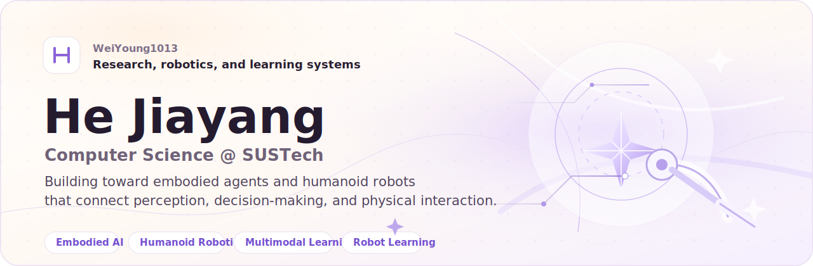

---

<table>
<tr>
<td width="64%" valign="top">

## About

I am a Computer Science undergraduate at **Southern University of Science and Technology (SUSTech)**.

My work focuses on **Embodied AI**, **humanoid robotics**, **multimodal learning**, and **robot learning**. I am interested in systems that connect perception, decision-making, and physical interaction, especially agents and robots that can learn from multimodal signals and act robustly in complex environments.

</td>
<td width="36%" align="center">

</td>
</tr>
</table>

  
  &nbsp;&nbsp;
  <a href="./index.html"><b>Homepage</b></a>
  &nbsp;·&nbsp;
  <a href="./blog.html"><b>Blog</b></a>
  &nbsp;·&nbsp;
  <a href="mailto:12213023@mail.sustech.edu.cn"><b>Email</b></a>
  &nbsp;&nbsp;
  

---

## Research Focus

<table>
<tr>
<td width="50%" valign="top">

**Embodied AI** 
Perception-action loops, interactive agents, and environment-grounded understanding.

</td>
<td width="50%" valign="top">

**Humanoid Robotics** 
Motion generation, control, simulation, and learning-based policies for humanoids.

</td>
</tr>
<tr>
<td width="50%" valign="top">

**Multimodal Learning** 
Vision, language, sensors, representation learning, and cross-modal reasoning.

</td>
<td width="50%" valign="top">

**Robot Learning** 
Imitation, reinforcement learning, generalization, and sim-to-real robustness.

</td>
</tr>
</table>

---

## Personal Website & Blog

The site is static and GitHub Pages-friendly, with a clean warm-white homepage and a lightweight personal blog.

| Entry | Path |
| --- | --- |
| Homepage | [`index.html`](./index.html) |
| Blog index | [`blog.html`](./blog.html) |
| Blog posts | [`posts/`](./posts/) |

---

## Contact

- GitHub: [WeiYoung1013](https://github.com/WeiYoung1013)
- Email: [12213023@mail.sustech.edu.cn](mailto:12213023@mail.sustech.edu.cn)
